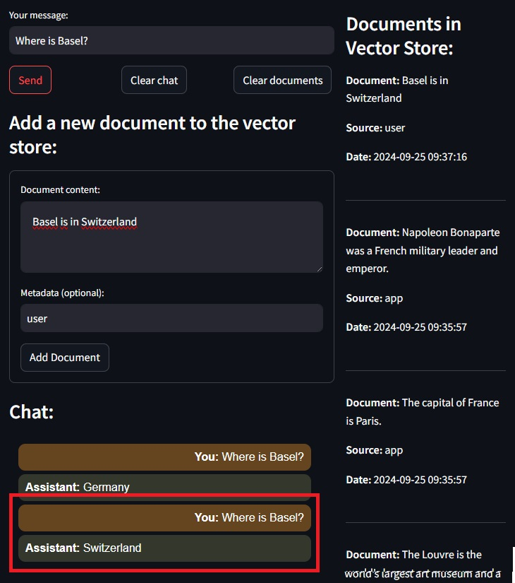

# 1. Streamlit RAG Chatbot Application `stAppChatRag.py`

This project demonstrates a **Retrieval-Augmented Generation (RAG)** chatbot using pre-trained models from Hugging Face. The application utilizes the **HuggingFace `sentence-transformers/all-mpnet-base-v2`** model for embeddings and the **`google/flan-t5-base`** model for text generation. These models enable the chatbot to generate contextually relevant responses based on both the user’s query and a set of documents stored in **Chroma DB**.

The chatbot is designed to interact with a set of documents, which are initialized at the start of the application. Users can also add or delete documents dynamically to refine the chatbot's knowledge base.

### First answer

### Added document

### Second answer

# 2. Streamlit Chatbot Application `stAppChat.py`

This project demonstrates a chatbot utilizing the `google/flan-t5-base` model for text generation.

### Presentation

# 3. Streamlit Image Caption Generator Application `stAppCapImages.py`

This project demonstrates an image captioning application utilizing the `Salesforce/blip-image-captioning-base` model.

### Presentation

# 4. Streamlit Image Caption Generator Application `stAppPlotly.py`

This project demonstrates a data analysis application that leverages `Plotly` to create interactive data visualizations. The application can render both 2D and 3D plots, allowing users to explore datasets in a dynamic and visually engaging way.

### Presentation of 2D chart

### Presentation of 3D charts

# 5. Panel  Chatbot Application `pnAppChat.py`

This project demonstrates a chatbot utilizing the `google/flan-t5-base` model for text generation.

### Presentation

# 6. Panel Image Caption Generator Application `pnAppPlotly.py`

This project demonstrates a data analysis application that leverages `Plotly` to create interactive data visualizations. The application can render both 2D and 3D plots, allowing users to explore datasets in a dynamic and visually engaging way.

### Presentation of 2D chart

### Presentation of 3D charts

